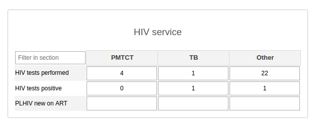
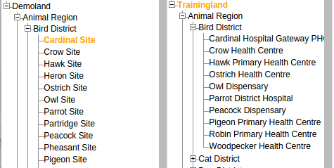

#Introduction

In this document, we will simulate a  typical data exchange scenario between a sample Ministry of Health HMIS (Trainingland) with the PEPFAR data management system, DATIM. We will use the "Demoland" training instance of DATIM, located at [https://demo.datim.org](https://demo.datim.org). Although the examples will be quite trivial and some assumptions will be made for the sake of simplicity, many of the approaches and techniques will be applicable to more complex data exchanges which may take place in the the real world.

To facilitate this tutorial, we will use two instances of [DHIS2](https://www.dhis2.org) which are similar in some ways to each other. Both of these databases are based on fictitious countries, named Trainingland and Demoland. 
Trainingland is a training database developed by the DHIS2 core development team. The database is freely available from a GitHub repository [here](https://github.com/dhis2/dhis2-trainingland). An online version of the database has been made available [here](https://play.dhis2.org/training/). Trainingland has been developed by the DHIS2 core development team to provide a training environment, and is meant to represent a rather typical Ministry of Health installation of DHIS2. Demoland is a database developed by the DATIM development team, built for the same training purposes for the PEPFAR specific system. In both databases, synthetic data has been imported, with specific characteristics meant to be used during training exercises. Demoland and Trainingland both share a similar organisational unit hierarchy, with some differences which will be explored below.

In this exercise, we will simulate the data exchange of a few data elements between Trainingland and Demoland.  Trainingland's organisational hierarchy is quite similar to Demoland to a large extent, but has been changed for various creative purposes. This difference in the organisation unit hierarchy is quite typical between two different instances of DHIS2 which may operate in the same country. Often the names of organisation units (sites) are similar, but not quite the same.  In addition to this, the metadata of the two systems is completely different, but similar in some respects. Trainingland has data elements which are more typical of a MoH system, with a broad range of basic data elements being collected. DATIM is more focused on PEPFAR specific programmatic indicators, which tend to be much more specific and varied. These two factors will create challenges in our data exchange scenario, which we will attempt to create some solutions for. 

The overall goals of this exercise are: 

* Interact with the application programming interface (API) of the two different systems
* Demonstrate approaches for how to handle data exchange problems
* Produce some sample data payloads which can be imported into DATIM to fully simulate the exercise

##Getting started /Pre-requisites

This exercise has been written in the R programming language. R is a useful tool, since it is freely available and works on multiple platforms. It has a useful REPL (Read Eval Print Loop) function, which allows code to be written and evaluated interactively. You can get a copy of R from [CRAN](https://cran.r-project.org/). [RStudio](https://www.rstudio.com/products/rstudio/download/) is a free interactive development environment which is also handy to have, but not required.  If you would like to follow along with the code in this example, you should grab a copy of R and install it on your computer. The reproducible source code of this tutorial is available [here](https://github.com/jason-p-pickering/demoland-dataexchange)

While R has been used for this example, any programming language could theoretically be used. Scripting languages such as Python, Node.JS, Ruby, PHP, etc would also likely be equally capable of performing this exercise. Another possible approach would be to use other data-centric tools like SPSS, SASS, or Stata. Another possible approach would be to use other tools like Microsoft Access or Excel. Its really up to you to decide what is most appropriate for your environment and skill set! 


In addition to having a scripting language available (like R or your favorite), it would be useful to get a copy of the Trainingland database available on your own machine. This is not required to complete this tutorial, but would be useful to allow you to work offline. The easiest way to do this is to install the [Docker platform](https://docs.docker.com/engine/installation/) for your operating system and then to use the docker-compose script from the DHIS2 core development team made available [here](https://raw.githubusercontent.com/jason-p-pickering/dhis2-docker/master/docker-compose-trainingland.yml). If this is not possible, you can always use the instance made available online [here](https://play.dhis2.org/training/dhis-web-commons/security/login.action).

In addition to these pre-requisites, it is assumed that the reader has familiarized themselves with the DHIS2 API [documentation](http://dhis2.github.io/dhis2-docs/master/en/developer/html/ch01.html). 

##Approaching the problem

The basic functions operations which will be required to transform and import data will be described in this section. As mentioned above, just about any scripting language should be capable of performing these operations. 

* Retrieve data and metadata from an API: If the system was DHIS2, several different formats are available, including XML, JSON and CSV. It would also be possible to use the CSV format, and download the data directly as a file, and manipulate it in something like Microsoft Excel. 

* Create maps of identifiers between the two systems: Metadata (organisation units, data elements, etc) will have different identifiers in both systems. In many cases they will refer to the same place or same phenomenon, but simply have different codes or names. By creating a map of these identifiers between each system, we can transform the data from one system's identification scheme to the other. 

* Perform transformation of the data: Typically, we will often need to transform data in some way. This might include aggregating the data from monthly to quarterly frequency. It may also involve calculation of a variable which is in the destination system, but not directly present in the source system. We will see an example of this below, namely how to calculate "HIV tests negative" from "HIV tests performed" and "HIV tests positive".

* Ability to save the data which can be imported to DATIM. There are four choices, each with some advantages and disadvantages. DHIS2 supports three native formats for data import (XML, JSON and CSV) which are described in detail in the DHIS2 documentation. ADX is a standards based XML format which is also supported. Further documentation and resources are available [here](http://dhis2.github.io/dhis2-docs/2.21/en/developer/html/ch01s13.html)


Typically, the first part in identifying the data exchange approach is to determine what is actually possible to be exchanged.  Even through both Demoland and Trainingland are using DHIS2, they have different metadata which needs to be analyzed and matched where possible. Typically, there would need to be M&E experts involved in order to determine the method to map data elements from one system to data elements of another system. The best place to get started, is to look at the data entry forms of the two systems. For now, we will focus on HTC testing. 

In the Trainingland database, we can see there are data elements related to HIV testing. 



It appears that the data has been disaggregated by persons tested, persons testing positive, and by service point type (PMTCT,TB and Other). 

DATIM has considerably more HTC data elements, broken down by various age groups, testing results, service point type, and DSD (Direct service delivery) and TA (Technical assistance). We first need to figure out how to map the data elements from the source system (Trainingland) onto the destination system (Demoland). The easiest looks like 
the "top-level numerator" in DATIM, HTC_TST (N, DSD): HTC received results, which we will assume, can be mapped to the total in Trainingland for "HIV tests performed".


##Organisation unit mapping

Now that we have determined that some data elements can be mapped to each other, we need to consider the organisation unit hierarchy. Demoland and Trainingland have similar hierarchies, but they are a bit different as seen below.



Take note that some of the sites appear to be similar in terms of how they are named, namely "Cardinal Site" in Demoland and "Cardinal Hospital Gateway PHC" in Trainingland. For the purposes of this exercise, we will assume that if the first name matches ("Cardinal"), then the two sites are the same. In reality, a much more detailed analysis would be required. However, the expected output will be the same: a map of organisation units from the source system to the destination system. In this case, we will use an automated matching (on the first name which matches), but it would not be expected that in all situations, it would be this simple to create a map from one system to another. 

##Getting started

For the purposes of simplicity for this example, we will restrict ourselves to the "Bird District", although the same approach could be generalized and applied to other districts as well. Let's get started. 

We will load a few helper libraries first and define the login details for the two systems.

```{r,results='hide',message=FALSE}
#HTTP operations
require(httr)
require(RCurl)
#JSON manipulation
require(jsonlite)
#Data reshaping
require(plyr)
require(reshape2)
#XML
require(XML)

#login details for Trainingland
source.url<-"http://localhost:8888"
source.username<-"admin"
source.password<-"district"

#Login details for Demoland
dest.url<-"https://demo.datim.org"
dest.username<-"partner"
dest.password<-"Password1"
```

First, we request a listing of organisation units in Bird District from the source system (Trainingland) and convert that to a data frame which we can work with more easily. As noted before, we will attempt to create a map of organisational units from the source system to the destination system, leveraging that some of the sites match on a portion of their names.


```{r}
#Orgunit mapping
#OUs from Bird District in Trainingland
url<-paste0(source.url,"/api/organisationUnits/Hq1ZHMHGvQE?fields=children[id,name]")
r<-httr::GET(url, httr::authenticate(source.username,source.password),httr::timeout(60))
r<- httr::content(r, "text")
#Change the JSON response to a data frame
ous.source<-jsonlite::fromJSON(r,flatten=TRUE)[[1]]

#Get the first name for each site
ous.source$first_name<-rapply(strsplit(ous.source$name," "), function(x) head(x, 1))
names(ous.source)<-paste0("source_",names(ous.source))
```

Note below that this is simply a list of organisation units from the source system, along with their internal identifiers on the source system. Additionally, we have created a new column **source_first_name** which we will use to match with the destination system in Demoland. 

```{r echo=FALSE}
head(ous.source, n=3L)
```

Next, we will perform the same operation with Demoland, and then merge (join) both of the data frames together to obtain the map of organisation units between both systems. Note that in the destination system, the ID of "Bird District" is different (LnGaK6y98gC). 

```{r}
#OUs from Bird District in Demoland
url<-paste0(dest.url,"/api/organisationUnits/LnGaK6y98gC?fields=children[id,name]")
r<-httr::GET(url, httr::authenticate(dest.username,dest.password),httr::timeout(60))
r<- httr::content(r, "text")
ous.dest<-jsonlite::fromJSON(r,flatten=TRUE)[[1]]

#Get the first name
foo<-strsplit(ous.dest$name," ")
ous.dest$first_name<-rapply(foo, function(x) head(x, 1))
names(ous.dest)<-paste0("dest_",names(ous.dest))
#Try and merge the two and see how close we are
ous<-merge(ous.source,ous.dest,by.x="source_first_name",by.y="dest_first_name",all=T)
```

We now have an object (below) which provides the necessary mapping between the source system (Trainingland) and the destination system (Demoland). Take note that "Heron Site" in Demoland has no equivalent match in the source system. This is a fairly common problem, where organisation units in one system do not have equivalent sites in another system. In this case of course, no data can be reported for "Heron Site" from the source system, as it does not exist there.

```{r echo=FALSE}
head(ous, n=4L)
```

##Data element mapping: HTC_TST (N, DSD): HTC received results (default)

Now that we have a map of organisation units for Bird District, we can move on to mapping of the data elements from one system to the other. We will start with the simplest example below.

``` 
HTC_TST (N, DSD): HTC received results (default) = HIV tests performed PMTCT + HIV tests performed TB  +
  HIV tests performed Other
```

We will need to request data from the source system (Trainingland) and transform the data to a format which we can import into Demoland. 
First, we note from the data entry form that the source data element is named "HIV tests performed" 
and has a category combo of "HIV service". Although the analytics engine of DHIS2 can aggregate this for us, for the sake of this exercise, we will request a bit more data and then transform and aggregate it in R. 

**Tip** One of the easiest ways to develop an analytics URL, is to create a pivot table of the data which you actually need, and then press F12, and get the URL which is used by the Pivot Table to retrieve the data. We will build up the analytics request piece-by-piece, and then request the data from the Trainingland instance. To get data from Trainingland, we will interact with the analytics API, and create a URL which will provide the necessary data.

```{r}
#This is the basic endpoint we will interact with. 
url.base<-"http://localhost:8888/api/analytics.json?"

#We note from analyzing the data entry form of Trainingland, that HIV tests performed has the following UID
url.dx<-"dimension=dx:W19KeR5yuWm"

#The organisation unit dimension is requested for Bird District at level 4 (facility)
url.ou<-"&dimension=ou:Hq1ZHMHGvQE;LEVEL-4"

#We ask for the desired time periods
url.pe<-"&dimension=pe:2015Q1;2015Q2;2015Q3;2015Q4"

#This dimension is the category combo "HIV Service" which disaggregates
#The data by service type.
url.disagg<-"&dimension=smOoBl0O7ep:Cvx2nkewzgw;I0kOLNtdqRM;rdJ14klxSso"

#Return the data by name along with the metadata (set to true in the pivots)
url.meta<-"&displayProperty=NAME&skipMeta=false"

#Assemble the URL
url<-paste0(url.base,url.dx,url.ou,url.pe,url.disagg,url.meta)
#Get the data
r<-httr::GET(url, httr::authenticate(source.username,source.password),httr::timeout(60))
r<- httr::content(r, "text")
htc<-jsonlite::fromJSON(r,flatten=TRUE)

```

Once we make the request, a JSON object is returned from the server, which contains both the metadata as well as the data which was requested, which is described briefly below.

* headers: An list which describes the data response.
* metaData: A list which provides the metadata mapping from IDs to names. 
* width/height: Integers which provide the size of the data response
* rows: A matrix of values which corresponds to the structure provided in the headers list.

```{r echo=FALSE}
str(htc,max.level=1)
```

We will now proceed to transform the data from Trainingland to a JSON payload which we can import into Demoland. 
```{r}
#Start by extracting the data
htc.data<-data.frame(htc$rows)
#Assign the names to make it a bit more friendly
names(htc.data)<-htc$headers$column

#Lets remap the Organisation units
#First, get a map of all sites which match, ignoring the ones for which there is no match.
ous.matches<-ous[complete.cases(ous),c("source_id","dest_id","dest_name")]

#We merge this with the data, which will also filter out any incomplete matches.
htc.data<-merge(htc.data,ous.matches,by.x="Organisation unit",by.y="source_id")

#The data must be aggregated now, effectively removing the disaggregation related to HIV Service, as we are 
#focusing on the top line number right now.
#Make the number numeric so it can be aggregated
htc.data$Value<-as.numeric(as.character(htc.data$Value))

#And aggregate everything by quarter and organisation unit, using the destination organisation ID
htc.data<-aggregate(Value ~ Period + dest_id , data=htc.data[,c("Period","dest_id","Value")],FUN=sum)
#Rename the columns to standard DHIS2 format, as we will transform this back to JSON soon
names(htc.data)<-c("period","orgUnit","value")

```

Take note here we are renaming the columns of the data to match what DHIS2 expects in the JSON payload, which will simplify things a bit once when we create the JSON string to upload to the server. 

As we see below, we now have data which has been aggregated to remove the disaggregation present in the source system (HIV Service type). We have also remapped the organisation unit ids from the source system, onto the organisation units of the destination system. 

```{r echo=FALSE}
head(htc.data)
```

Next, we will assign the data element from Demoland. Since we are only working with a single data element, it is simple, but in a real system, a more comprehensive map and methods would need to be developed to map data elements from one system to the other.

```{r}
#We note from the data entry form of training land, that the 
#desitnation data has the following attributes for the 
#data element UID and the category option combo. 
#Assign these to the data, as we will need them when we send the payload
htc.data$dataElement<-"K6f6jR0NOcZ"
htc.data$categoryOptionCombo<-"HllvX50cXC0"
```

All data in the target system (Demoland) requires attribution of the data to a particular mechanism. Trainingland has no such information, so prior knowledge of which partner (or partners) is working in which facility and how much of the overall total reported, would need to be known beforehand. In this case, we will assign these to 
Parrot IM, which has an ID of *jgxivsFwmyR* in Demoland.

**Note:** For those intending to exchange data with PEPFAR’s production DATIM system, a list of Mechanisms actually mapped to DATIM sites/facilities will be provided by contacting any member of your PEPFAR Country Team who can direct your request to the DATIM help desk.

```{r}
htc.data$attributeOptionCombo<-"jgxivsFwmyR"
```

At this point, we should have everything we need in order to assemble our data payload. We will just create a new list and save it as a JSON string which we can then upload to Demoland.

```{r}
dv<-list(dataValues=htc.data)
cat(file="htc_demoland_trainingland.json",jsonlite::toJSON(dv,auto_unbox=TRUE))
```

We see that the JSON string has been produced, and should be ready to upload to Demoland.

```{r echo=FALSE}
paste0(substr(toJSON(dv,auto_unbox=TRUE),0,175),"...")
```

We can test the import of the data to see if we have constructed the payload correctly. 

```{r}
url<-paste0(dest.url,"/api/dataValueSets?dryRun=true&preheatCache=false")
RCurl::curlPerform(url=url,userpwd=paste0(dest.username,":",dest.password),
            httpauth = 1L,
            httpheader=c(Accept="application/json", 
                         Accept="multipart/*", 
                         'Content-Type' = "application/json"),
            postfields= toJSON(dv,auto_unbox=TRUE),
            verbose = FALSE )

```

From the response, it seems that things went well. `r length(dv$dataValues)` values were ignored, which is expected since we set the parameter *dryRun=true*, which will not actually save the data in the system, but rather simply validate that the payload is actually correct.


## Calculation HTC_TST (N, DSD, Results): HTC received results
This data elements in Demoland is disaggregated by positive and negative results, but in Trainingland the  data is disaggregated by number of tests and number of positive tests. Thus, we will need to calculate the negative results in Trainingland, and then prepare another payload, similar to the previous example.  We will assume in Trainingland, that there are no indeterminate tests, and that the negative tests can be derived from the total tests performed minus the positive tests.

Although DHIS2 is capable of aggregating monthly data to quarterly data, there could be instances in which you might need to perform some special aggregation on the quarterly data before importing to DATIM, such as with snapshot indicators like "Current on Treatment". In the case of this example however, we will just request the data by month, and then aggregate it to quarters in R, for the sake of the example. 

We start again by building up the URL which will be used to request the data from the source system. 

```{r}
#This is the basic endpoint we will interact with.
url.base<-"http://localhost:8888/api/analytics.json?"
#This time, we ask for the total number of tests as well as positive tests
url.dx<-"dimension=dx:W19KeR5yuWm;yqGMyktY9F1"
#The organisation unit dimension is requested for Bird District at level 4 (facility)
url.ou<-"&dimension=ou:Hq1ZHMHGvQE;LEVEL-4"
#Lets get the data by month, to show how we can aggregate monthly data to quarterly data, getting all data for 2015.
url.pe<-paste0("&dimension=pe:",paste("2015",sprintf("%02d",1:12),sep="",collapse=";"))
#We will omit any disaggregation from the analytics request, for the sake of simplicity. 
url.meta<-"&displayProperty=NAME&skipMeta=false"
#Return the data by name along with the metadata (set to true in the pivots)
url<-paste0(url.base,url.dx,url.ou,url.pe,url.meta)
#Get the JSON resource from the server
r<-httr::GET(url, httr::authenticate(source.username,source.password),httr::timeout(60))
r<- httr::content(r, "text")
htc<-jsonlite::fromJSON(r,flatten=TRUE)
#Convert the actual data to a data frame
htc.data<-data.frame(htc$rows)
#Assign the names to make it a bit more friendly
names(htc.data)<-htc$headers$column
#Lets remap the data element names. First lets make a data frame of the metadata.
metadata<-plyr::ldply(lapply(htc$metaData$names, function(x) t(unlist(x))))
names(metadata)<-c("id","name")

#Map the identifiers to names
htc.data$Data<-plyr::mapvalues(htc.data$Data,metadata$id,as.character(metadata$name),warn_missing=FALSE)
#Lets get rid of the "HIV tests " part of the name and factorize
htc.data$Data<-gsub("HIV tests ","",htc.data$Data)
htc.data$Data<-as.factor(htc.data$Data)
htc.data$"Organisation unit"<-as.factor(htc.data$"Organisation unit")
#Rename the columns to standard DHIS2 format
names(htc.data)<-c("dataElement","orgUnit","period","value")
```

As seen below, we now have a data frame with "performed" and "positive" data values for each site and month. With this, we can easily calculate the negative tests.


```{r echo=FALSE}
head(arrange(htc.data,orgUnit,period,dataElement))
```

Since the data has been requested in  monthly format, we will need to aggregate it to quarters and then calculate the number of negative tests from the total tests performed and the positive tests. In addition to that, we will need to aggregate the monthly data to quarterly data.

```{r}
htc.data$period<-as.factor(htc.data$period)
#We need to assign the monthly a calendar quarter which they fall into
whichQuarter<-function(x) {paste0(substr(x,0,4),"Q",ceiling(as.numeric(substr(x,5,6))/3)) }
htc.data$period<-sapply(htc.data$period,whichQuarter)

#Ensure that the values are numeric
htc.data$value<-as.numeric(as.character(htc.data$value))
#We will reshape the data, placing the "positive" and "performed" on a column and then calculating the negative tests. 
#We will also aggregate the monthly data to quarterly, assuming that any missing data can be assumed to be a zero.
htc.data<-reshape2::recast(htc.data, orgUnit + period ~ dataElement,
                           fun.aggregate=function(x) {sum(x,na.rm=T)})
#Now, we calcualte the negative results
htc.data$negative=htc.data$performed-htc.data$positive
```

At this point, we have reshaped the data and calculated the number of negative tests results and have aggregated this data from monthly to quarterly figures.


```{r echo=FALSE}
head(dplyr::arrange(htc.data,orgUnit,period))
```

This data is in so-called "wide" format, with multiple values on the columns. The data needs to be reshaped to "long" format, with a single data value on each row.

```{r}
#The data needs to be reshaped again from wide to long. We will take out the "performed" as it is no longer needed.
htc.data<-reshape2::melt(htc.data[,c("orgUnit","period","positive","negative")],id=c("orgUnit","period"))
#Remove any NAs, as we will not transmit these
htc.data<-htc.data[!is.na(htc.data$value),]
#We need to remap the organisation unit column, as this is now referring to the source, not the destination
htc.data<-merge(htc.data,ous.matches,by.x="orgUnit",by.y="source_id")

#We note from the data entry screens that this data element has the UID of 
#EjdjNEKUqUE
#While the category option combos are as follows
#Positive = XkqnsV4slkA
#Negative = ZZgjEm5kvv3

#Lets remap the "variable" column and use this as the category option combo column
htc.data$variable<-ifelse(htc.data$variable =="positive","XkqnsV4slkA","ZZgjEm5kvv3")
#Change the name of the variable column to conform to what DHIS2 expects
names(htc.data)[which(names(htc.data)=="variable")]<-"categoryOptionCombo"
```

At this point, we are almost ready to produce the data payload, but we need to be sure that the data frame is structured properly with the correct names. Additionally, DHIS2 expects all values to be characters. 

```{r echo=FALSE}
#Get rid of uneeded columns and rename
htc.data<-htc.data[ , -which(names(htc.data) %in% c("orgUnit","dest_name"))]
names(htc.data)[which(names(htc.data)=="dest_id")]<-"orgUnit"
#Add the data element 
htc.data$dataElement<-"EjdjNEKUqUE"
#Attribute the data to Parrot Implementing Mechanism
htc.data$attributeOptionCombo="jgxivsFwmyR"
#Ensure that everything is characters
htc.data<-plyr::colwise(as.character)(htc.data)
```

We will now produce the necessary JSON payload from our data, again using the ID for Parrot Implementing Mechanism in Demoland as our attribute option combination. 


```{r}
dv<-list(dataValues=htc.data)
cat(file="htc_demoland_trainingland_neg_pos.json",toJSON(dv,auto_unbox=TRUE))

url<-paste0(dest.url,"/api/dataValueSets?dryRun=true&preheatCache=false")
RCurl::curlPerform(url=url,userpwd=paste0(dest.username,":",dest.password),
            httpauth = 1L,
            httpheader=c(Accept="application/json", 
                         Accept="multipart/*", 
                         'Content-Type' = "application/json"),
            postfields= toJSON(dv,auto_unbox=TRUE),
            verbose = FALSE )
```

From the server response, we can see that our payload was valid, and that `r length(dv$dataValues)` would have been imported. 

##ADX mediated data exchange from Demoland to Trainingland

The previous two examples used the internal JSON format of DHIS2 to transmit data. We will now demonstrate a scenario where data from Demoland (based on DATIM) is exchanged with Trainingland (our reference HMIS system). For this example, we will use the ADX format to transmit the data. ADX is a standards based XML format. In certain data exchange scenarios, data may need to flow from a partner system (such as a PEPFAR partner) into the MoH system.

As in the other examples, we will start by requesting the data from the source system, this time from Demoland (the representative partner system) into Trainingland (representing the MoH system). In this scenario, we will exchange data between two similar data elements which provide the number of people newly started on ART.

* Demoland:  TX_NEW (N, DSD): New on ART (default)
* Trainingland: PLHIV new on ART (Other)

There will be a number of assumptions made for the sake of this example. They should not be taken to be recommendations or guidance of how the data exchange would actually occur in reality, but rather are meant to serve as technical examples only of how data can be exchanged between the two systems.

```{r}
#This is the basic endpoint we will interact with to get data
url.base<-"http://demo.datim.org/api/analytics.json?"
#This time, we ask for the total number of tests as well as positive tests
url.dx<-"dimension=dx:tG7ocyZ8kVA"
#The organisation unit dimension is requested for Bird District at level 6 (facility level in Demoland)
url.ou<-"&dimension=ou:LnGaK6y98gC;LEVEL-6"
#Lets get the data by month, to show how we can aggregate monthly data to quarterly data, 
#getting all data for Fiscal Year 2014
url.pe<-"&dimension=pe:2013Q4;2014Q1;2014Q2;2014Q3"
#We will omit any disaggregation from the analytics request, for the sake of simplicity. 
url.meta<-"&displayProperty=NAME&skipMeta=false"
#Return the data by name along with the metadata (set to true in the pivots)
url<-paste0(url.base,url.dx,url.ou,url.pe,url.meta)
```

We will use another user to get the data from the DATIM instance this time. The reason for this is, that users are often restricted to particular mechanisms. In this case, since we are exchanging data from a DATIM instance (where data is attributed to a particular mechanism) to a reference MoH system (which typically would not record PEPFAR mechanism information), we will ask for all the data aggregated across all possible mechanisms, since this dimension is not present in the MoH system.


```{r}
r<-httr::GET(url, httr::authenticate("analysis","Password1"),httr::timeout(60))
r<- httr::content(r, "text")
htc<-jsonlite::fromJSON(r,flatten=TRUE)


htc.data<-data.frame(htc$rows)
#Assign the names to make it a bit more friendly
names(htc.data)<-htc$headers$column
#Lets remap the data element names. First lets make a data frame of the metadata
metadata<-plyr::ldply(lapply(htc$metaData$names, function(x) t(unlist(x))))
names(metadata)<-c("id","name")

#Map the identifiers to names
htc.data$Data<-plyr::mapvalues(htc.data$Data,metadata$id,as.character(metadata$name),warn_missing=FALSE)
#Lets rename this columns
names(htc.data)[names(htc.data) == "Organisation unit"]<-"orgUnit"
names(htc.data)[names(htc.data) == "Data"]<-"dataElement"
names(htc.data)[names(htc.data) == "Value"]<-"value"
names(htc.data)[names(htc.data) == "Period"]<-"quarter"
```

Another wrinkle which we must solve is how to deal with the differing reporting frequencies. In Demoland, the data is reported quarterly, thus, monthly data for this data element is not available. We will create two functions to deal with this. The first (below) will produce three monthly periods from a quarter. Thus, if the quarter is reported to be "2015Q1", the function will produce three monthly periods for January, February, and March 2015. 

```{r}
#Create a new function to transform monthly periods to quarters
#Ensure the monthly periods are fomatted according to the ADX spec
monthlyPeriodsFromQuarters<-function(x) {
year<-paste0(substr(x,0,4))
end<-as.numeric(substr(x,6,6))*3
paste0(year,"-",sprintf("%02d",seq(end-2,end)),"-01/P1M") }
```

Next, we will split the quarterly figure into three roughly equal monthly values, such that the sum of the new monthly values will remain equal to the quarterly value which was retrieved from Demoland.

```{r}

monthlyValuesFromQuarters<-function(x) {
foo<-round(x / 3,0)
last<-x-foo*2
return(c(rep(foo,2),last)) }
```


Next, we will simply create a new data frame, which will effectively transform the quarterly data into monthly data. 

```{r}
data.months<-htc.data[0,]
for (i in 1:nrow(htc.data)){
others<-htc.data[i,c("dataElement","orgUnit")]
vals<-monthlyValuesFromQuarters(as.numeric(as.character(htc.data$value[i])))
period<-monthlyPeriodsFromQuarters(htc.data$quarter[i])
data.months<-rbind(data.months,cbind(others,vals,period,row.names=NULL))
}
```

```{r echo=FALSE}
head(data.months)
```

Next, we will remap the data elements. The ADX data format also supports the transmission of data element metadata as codes (similar to the native DXF format of DHIS2). After analyzing the metadata from Trainingland, we see that we need to use the following mappings.

```
#Data element code  = ART_NEW
#Category code = HIV_SERVICE
#Category option = Other
#Dataset code = PHC_MONTHLY
```

As in the previous example, we need to remap the organisation units, but this time we will map from Demoland to Trainingland.
```{r}
#Remap the OUs
data.months<-merge(data.months,ous[!is.na(ous$source_id),c("source_id","dest_id")],by.x="orgUnit",by.y="dest_id")
#Ensure everything is characters
data.months<-plyr::colwise(as.character)(data.months)
```

Since we are transmitting data to Traininlgand, and its organisational unit UID is now in the "source_id" column, we need to be sure to use that to correctly identify the site.

Once the data has been assembled, we will create the XML payload based on the ADX data transmission format and import it into the server. 

```{r}
adx.doc<-newXMLDoc()
adx<-newXMLNode("adx",namespaceDefinitions = c("http://ihe.net/quality/schema/adx",xsi="urn:ihe:qrph:adx:2015"),
attrs=c( dataElementIdScheme="CODE",
 orgUnitIdSCheme="UID"),
doc=adx.doc)
foo<-addAttributes( adx,"xsi:schemaLocation" = "urn:ihe:qrph:adx:2015 ../schema/adx_loose.xsd")
#The exported attribute is required by ADX
foo<-addAttributes(adx, "exported" = format(Sys.time(), "%Y-%m-%dT%H:%M:%SZ"))


for (i in 1:nrow(data.months)) {
attribs<-list(orgUnit=data.months$source_id[i],
#We must correctly format the period to correspond to what ADX requires
period=data.months$period[i],
#The dataset code is required by ADX
dataSet="PHC_MONTHLY",
comment="Imported from Demoland")
group<-newXMLNode("group",attrs=attribs,parent=adx)
attribs<-list(dataElement="ART_NEW",HIV_SERVICE="Other",
value=as.character(data.months$value[i]))
dataValue<-newXMLNode("dataValue",attrs=attribs,parent=group) }

url<-paste0(source.url,"/ohie/dataValueSets?dataElementIdScheme=CODE&orgUnitIdScheme=UID")
curlPerform(url=url,userpwd=paste0(source.username,":",source.password),
                httpauth = 1L,
                httpheader=c(Accept="application/xml", 
                             Accept="multipart/*", 
                             'Content-Type' = "application/xml"),
                postfields= as(adx.doc,"character"),
                verbose = FALSE ) 
```

From the server response, we can see that the data was imported. A short sample of what we imported is shown below for the sake of clarity.
````
<?xml version="1.0"?>
<adx xmlns="http://ihe.net/quality/schema/adx" xmlns:xsi="urn:ihe:qrph:adx:2015" dataElementIdScheme="CODE" orgUnitIdSCheme="UID" xsi:schemaLocation="urn:ihe:qrph:adx:2015 ../schema/adx_loose.xsd" exported="2016-01-01T11:17:01Z">
  <group orgUnit="QAsgboVXFjE" period="2013-10-01/P1M" dataSet="PHC_MONTHLY" comment="Imported from Demoland">
    <dataValue dataElement="ART_NEW" HIV_SERVICE="Other" value="19"/>
  </group>
  ...
````


##Conculsions and summary

In this paper, we have sought to demonstrate a few trivial examples of how data can be successfully exchanged between two instances of DHIS2, one representing a reference HMIS system (Trainingland) and the other a typical installation of DATIM, the PEPFAR specific implementation of DHIS2. Metadata must always be matched between the two systems, usually through some map which provides a means to map identifiers from the source system  onto the identifiers of the destination system. Often, certain data values may need to be calculated through other means, when they are not directly available. Lastly, we show how the ADX standards based XML format can be used to exchange data. 

Although this paper demonstrates some very basic technical means to exchange data between these two systems, much more work would be needed in the real world, especially to establish the maps and transformations from the source to destination systems. Organisation unit hierarchies present many challenges when they are not synchronized, as many situations will arise where data may exist in one system for a given site, but there will be no clear match in the target system. Usually, it is not as simple as we have made it here, i.e. matching first names. Implementers seeking to implement data exchange systems should ensure that there is close collaboration between M&E experts to determine how and if data elements from one system to the other can be mapped or derived. Close collaboration between the stakeholders of both systems will help to ensure a smoother data exchange process. 
